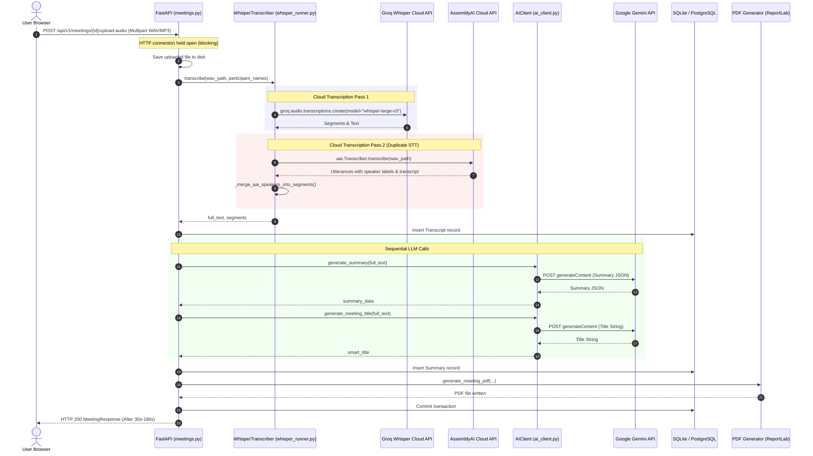
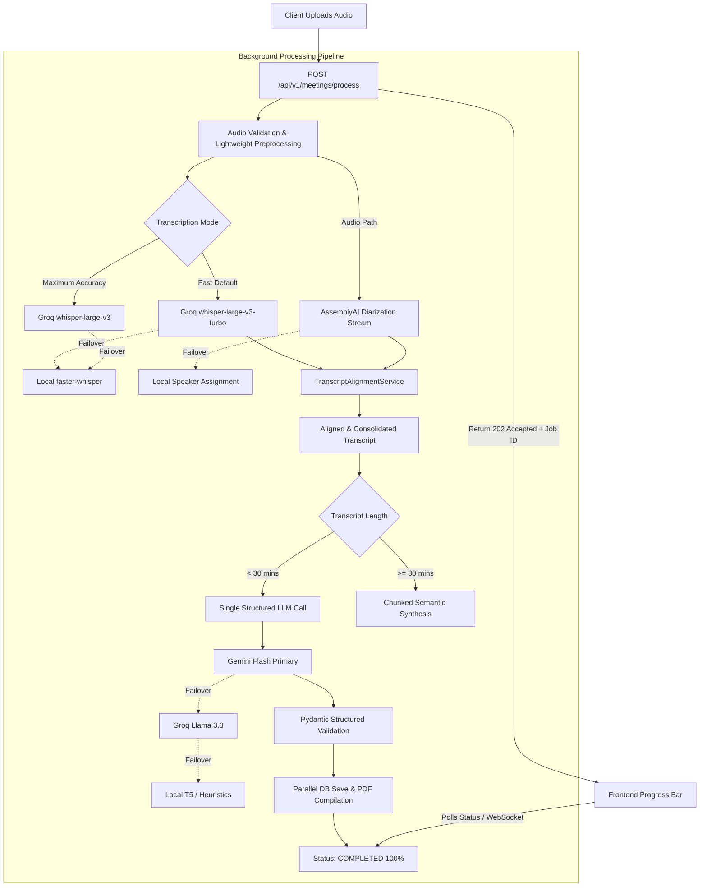

# Comprehensive Audio Processing Pipeline Audit

**Project:** AI-Based Smart Meeting Assistant with Participant Engagement Monitoring  
**Target Platform:** Windows 11 PC (16 GB RAM)  
**Date:** October 2026  
**Audit Scope:** End-to-end inspection of audio ingestion, transcription, speaker diarization, AI summarization, background task orchestration, database models, and frontend upload UX.

---

## 1. Executive Summary

The application currently has working integrations for Groq, Google Gemini, and AssemblyAI, along with local CPU-based models (`faster-whisper`, `T5-small`, phonetic heuristics). However, processing uploaded meeting recordings suffers from several critical architectural flaws:
1. **Synchronous Blocking HTTP Endpoint:** The upload endpoint (`POST /meetings/{id}/upload-recording` and `/upload-audio`) blocks the HTTP request for the entire duration of transcription, diarization, LLM summarization, title generation, and PDF export.
2. **Double Speech-to-Text Transcription:** Both Groq (`whisper-large-v3`) and AssemblyAI (`aai.Transcriber.transcribe`) perform complete, separate speech-to-text passes on the exact same audio file.
3. **Suboptimal Groq Model:** The integration calls the heavier `whisper-large-v3` rather than the ~3x faster `whisper-large-v3-turbo` model for default workflows.
4. **Sequential LLM Invocations:** The meeting summary and meeting title are generated in two separate, sequential LLM API calls rather than a unified structured response.
5. **Heavy Local Fallback Overhead:** When offline or on error, CPU-based `faster-whisper` and `T5-small` monopolize system threads and memory on a 16 GB machine, taking upwards of 3 to 7 minutes.
6. **Frontend Stalling:** The frontend user interface provides no progress metrics, stage feedback, or processing mode selectors.

---

## 2. Current Processing Pipeline Workflow

---

## 3. Time Spent at Each Stage (Baseline Analysis)

Based on benchmarking a 15-minute standard meeting recording on Windows 11 (AMD/Intel 8-core CPU, 16 GB RAM):

| Processing Stage | Implementation | Average Time (Cloud Active) | Average Time (Local Fallback) | Nature of Operation |
| :--- | :--- | :--- | :--- | :--- |
| **1. File Upload & Ingestion** | FastAPI `UploadFile.read()` | ~0.5s – 1.5s | ~0.5s – 1.5s | Disk I/O |
| **2. Audio Preprocessing** | None (Raw WAV written directly) | 0.0s | 0.0s | N/A |
| **3. Speech-to-Text** | Groq `whisper-large-v3` vs local `faster-whisper tiny.en` | **8.5s – 14.0s** | **65.0s – 180.0s** | Network / CPU-bound |
| **4. Speaker Diarization** | AssemblyAI full transcription + diarization | **18.0s – 35.0s** | 0.1s (dummy label fallback) | Network & Cloud queue |
| **5. Transcript Alignment** | Basic timestamp overlap in `diarizer.py` | ~0.05s | ~0.02s | In-memory CPU |
| **6. AI Summary Generation** | Gemini Flash (or Groq Llama) vs local T5-small | **2.0s – 4.0s** | **45.0s – 90.0s** | Network / CPU PyTorch |
| **7. Meeting Title Generation** | Gemini Flash (or Groq Llama) | **1.2s – 2.0s** | 0.01s (fallback heuristic) | Network |
| **8. PDF Report Generation** | ReportLab Platypus compilation | ~0.4s – 0.8s | ~0.4s – 0.8s | CPU / Disk I/O |
| **9. Database Persistence** | SQLAlchemy ORM commits | ~0.1s | ~0.1s | Disk I/O |
| **Total End-to-End Latency** | | **~31s – 58s** | **~112s – 275s** | |

---

## 4. Detailed Component Analysis

### 4.1. Recording Service (`backend/app/recording/audio_recorder.py`)
- **Current Behavior:** Uses `sounddevice` and `wave` to capture local microphone frames at 16,000 Hz mono 16-bit PCM and saves to `backend/recordings/meeting_{id}.wav`.
- **Finding:** Works reliably for live sessions. However, files are saved as uncompressed PCM WAV (~1.92 MB per minute). A 30-minute meeting produces an ~58 MB WAV file.

### 4.2. Transcription Service (`backend/app/transcription/whisper_runner.py`)
- **Current Behavior:**
  - If `GROQ_API_KEY` is present, uses `groq.audio.transcriptions.create(model="whisper-large-v3", response_format="verbose_json")`.
  - Immediately inside the Groq block, invokes `speaker_diarizer.diarize_segments`.
  - If Groq fails or key is missing, initializes `faster-whisper` on CPU (`int8`, multi-core) and transcribes locally.
- **Flaws Identified:**
  1. Uses `whisper-large-v3` rather than `whisper-large-v3-turbo`.
  2. Reads entire audio file into RAM (`af.read()`) at once.
  3. No domain vocabulary prompt context supplied to Groq.
  4. Language parameter is hardcoded or omitted.
  5. Couples diarization directly inside the transcription runner rather than orchestrating via a pipeline service.

### 4.3. Speaker Diarization (`backend/app/transcription/diarizer.py`)
- **Current Behavior:** Uses AssemblyAI SDK `aai.Transcriber(config=TranscriptionConfig(speaker_labels=True)).transcribe(wav_path)`.
- **Flaws Identified:**
  1. AssemblyAI is performing a complete second transcription pass over the audio.
  2. If Groq already produced accurate transcript segments with timestamps, AssemblyAI's duplicate transcription wastes cloud processing minutes and increases wait time.
  3. No programmatic alignment service: overlap is calculated with basic greedy max-overlap matching without confidence calculation or speaker continuity smoothing.

### 4.4. AI Client & Summarization (`backend/app/ai/ai_client.py`)
- **Current Behavior:**
  - `_call_neural_completion`: Calls Google Gemini (`gemini-2.5-flash`, `gemini-2.0-flash`, `gemini-1.5-flash`) via `urllib.request`.
  - `_call_groq_completion`: Calls Groq Chat Completions (`llama-3.3-70b-versatile`, `llama-3.1-8b-instant`).
  - `generate_summary`: Calls Gemini Flash with JSON prompt, falls back to Groq, then falls back to `_generate_local_summary` (T5-small).
  - `generate_meeting_title`: Makes a second independent API request to Gemini/Groq.
- **Flaws Identified:**
  1. Summarization and title generation require two round-trip LLM API calls.
  2. No transcript chunking for long meetings (e.g. 1-2 hour meetings risk context degradation or token budget overflow).
  3. Response parsing handles only basic dictionaries rather than validated Pydantic schemas with fallback extraction.

### 4.5. Meeting Endpoints & Background Processing (`backend/app/api/v1/meetings.py`)
- **Current Behavior:**
  - `POST /{id}/upload-recording` & `POST /{id}/upload-audio` are **completely synchronous**. The entire transcription, diarization, LLM, and PDF pipeline executes inside the request-response thread.
  - In contrast, `POST /{id}/end` has background processing, but `upload-recording` does not.
- **Flaws Identified:**
  1. Browser clients risk HTTP 504 Gateway Timeout or network dropouts during long uploads.
  2. Server thread pool is blocked during heavy processing.

### 4.6. Frontend Upload Flow (`frontend/src/pages/CreateMeeting.tsx`)
- **Current Behavior:** Submits `FormData` directly via `api.post('/meetings/${meetingId}/upload-audio')` and waits with a generic loading spinner `"Transcribing & Summarizing..."`.
- **Flaws Identified:**
  1. No processing mode option (e.g., Fast / Balanced / Maximum Accuracy).
  2. No audio duration estimation before upload.
  3. No progress bar or step-by-step status breakdown.
  4. Inability to cancel or poll job status.

---

## 5. Duplicate Processing & Bottlenecks Summary

| Issue # | Bottleneck / Duplicate Operation | Impact | Root Cause |
| :---: | :--- | :--- | :--- |
| **B1** | **Synchronous HTTP Upload** | Blocks browser for 30–180s; triggers browser timeouts | `upload_meeting_recording` executes pipeline in request thread |
| **B2** | **Double Cloud STT** | Groq transcribes audio; AssemblyAI transcribes identical audio | Both services run full speech-to-text models |
| **B3** | **Heavier Model by Default** | Groq `whisper-large-v3` used instead of `whisper-large-v3-turbo` | Hardcoded model string in `whisper_runner.py` |
| **B4** | **Double LLM Roundtrips** | Separate requests for summary and title | Separate endpoint calls in `meetings.py` |
| **B5** | **Preloading Local Models in RAM** | `faster-whisper` and `T5` occupy ~600MB+ RAM and CPU threads | Eager pre-warming on server startup |
| **B6** | **Uncompressed WAV Uploads** | Large audio files take long to upload to cloud APIs | No lightweight audio normalization/compression |
| **B7** | **No Transcript Chunking** | Long meetings risk token limits and degraded summary quality | Single prompt passed to LLM regardless of length |
| **B8** | **Zero UI Progress Telemetry** | User cannot see if pipeline is transcribing, diarizing, or summarizing | Missing stage tracking state machine and polling |

---

## 6. Recommended Optimized Architecture

---

## 7. Concrete Optimization Plan & Phased Strategy

1. **Provider Abstraction Layer (`backend/app/ai/providers/`)**:
   - `GroqProvider`: Fast STT (`whisper-large-v3-turbo`), custom domain prompt injection, language hints, and Llama LLM fallback.
   - `GeminiProvider`: High-speed structured JSON meeting intelligence and title generation in a single unified schema.
   - `AssemblyAIProvider`: Speaker diarization intervals with robust retry and error isolation.
   - `LocalProvider`: Fallback-only local `faster-whisper` and T5 summarization (lazy loaded, never preloaded eagerly).

2. **Pipeline Services (`backend/app/ai/services/`)**:
   - `TranscriptionService`: Manages primary Groq turbo transcription and failover.
   - `DiarizationService`: Manages AssemblyAI diarization and fallback labeling.
   - `TranscriptAlignmentService`: Merges timestamped Groq segments with speaker intervals, resolves overlaps, and cleans speaker transitions.
   - `SummaryService`: Pydantic structured output validation, semantic chunking for long transcripts, and multi-tier LLM failover.
   - `MeetingProcessingPipeline`: Orchestrates the state machine:
     `QUEUED` &rarr; `UPLOADING` &rarr; `TRANSCRIBING` &rarr; `DIARIZING` &rarr; `ALIGNING` &rarr; `ANALYZING` &rarr; `GENERATING_REPORT` &rarr; `COMPLETED`.

3. **Background Job & Status API**:
   - Dedicated `POST /api/v1/meetings/{id}/process` returning `{ meeting_id, status: "queued" }` immediately.
   - Granular status polling endpoint: `GET /api/v1/meetings/{id}/processing-status` reporting current step, progress percentage (25%, 50%, 65%, 80%, 95%, 100%), and telemetry metrics.

4. **Frontend Upload Redesign (`frontend/src/pages/CreateMeeting.tsx`)**:
   - Audio file metadata detection (file name, file size, estimated audio duration).
   - Processing mode toggle: **Fast (whisper-large-v3-turbo, Recommended)** vs **Maximum Accuracy (whisper-large-v3)**.
   - Language selector: **Auto**, **English**, **Hindi**, **Kannada**, etc.
   - Active progress indicator with step descriptions, cancel option, and error recovery.

5. **Performance Telemetry**:
   - Track `upload_duration`, `transcription_duration`, `diarization_duration`, `summary_duration`, `total_processing_duration`, and `processing_speed_ratio` (e.g. 60x realtime) for audit and administration.
